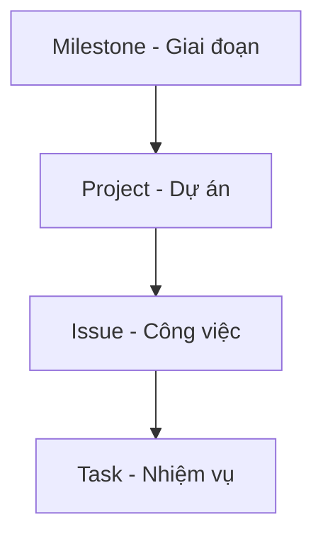

# TÀI LIỆU HƯỚNG DẪN SỬ DỤNG GITHUB

---

## 1. Giới thiệu chung về GitHub

1.1. **GitHub là gì?**  
- Giải thích ngắn gọn GitHub là nền tảng quản lý mã nguồn (phiên bản), hỗ trợ cộng tác, chia sẻ và lưu trữ dự án.  
- Giới thiệu các tính năng chính: kho lưu trữ (repository), Issues, Pull Requests, Projects…

1.2. **Tài liệu tham khảo**  
- [Bắt đầu với GitHub (Get started with GitHub)](https://docs.github.com/en/get-started)

---

## 2. Tạo và thiết lập tài khoản GitHub

2.1. **Đăng ký tài khoản**  
- Hướng dẫn truy cập [github.com](https://github.com/) để đăng ký tài khoản.  
- Xác minh email, thiết lập bảo mật.

2.2. **Cài đặt cấu hình cơ bản**  
- Thiết lập ảnh đại diện (avatar).  
- Cài đặt tên hiển thị (profile name), tiểu sử (bio).  
- (Tuỳ chọn) Kích hoạt xác thực hai yếu tố (2FA) để bảo mật.  
- Tham khảo: [Managing your GitHub account settings](https://docs.github.com/en/account-and-profile/setting-up-and-managing-your-github-user-account)

---

## 3. Tạo và quản lý kho lưu trữ (Repository)

3.1. **Tạo Repository**  
- Nhấn nút **+** (New) ở góc trên bên phải → **New repository**.  
- Chọn Public/Private, đặt tên, mô tả.  
- Chọn “Initialize this repository with a README” hoặc để trống nếu muốn tạo rỗng.

3.2. **Cài đặt Repo**  
- Thiết lập **branch** chính (default branch) – thường là `main`.  
- Thêm license, file .gitignore nếu cần.

3.3. **Tài liệu tham khảo**  
- [Creating a repository](https://docs.github.com/en/get-started/quickstart/create-a-repo)

---

## 4. Giới thiệu về GitHub Projects

# Sơ đồ Quản lý Dự án

4.1. **Các phiên bản Projects**  
- **Projects Classic** và **Projects (Beta)**.  
- Sự khác biệt: Projects Beta có nhiều tính năng hiện đại hơn (Board, Table, Roadmap…).

4.2. **Tạo Project mới**  
- Tại trang **Projects** (trong repository hoặc trong profile), nhấn **New project**.  
- Đặt tên, chọn **Template** (nếu có).  
- [Tài liệu chính thức về GitHub Projects](https://docs.github.com/en/issues/planning-and-tracking-with-projects)

---

## 5. Quản lý công việc bằng GitHub Projects

### 5.1. Thêm công việc (Issue) vào Project

1. **Tạo Issue**  
   - Tại tab **Issues** → **New issue**.  
   - Đặt tiêu đề, mô tả (có thể thêm checklist công việc con).  
   - [Creating an issue](https://docs.github.com/en/issues/tracking-your-work-with-issues/creating-issues)

2. **Thêm Issue vào Project**  
   - Trong giao diện Issue, chọn **Projects** (phía bên phải), hoặc  
   - Vào giao diện Project → **+ Add item** → Nhập `#` + số Issue.

### 5.2. Board (Kanban)  
- Ở Projects Beta, chọn **Board view**.  
- Sử dụng các cột (chẳng hạn: *To do*, *In progress*, *Done*).  
- Kéo – thả các card (Issue) giữa các cột để cập nhật tiến độ.  
- [Organizing your work with project boards](https://docs.github.com/en/issues/planning-and-tracking-with-projects/organizing-your-work-with-project-boards)

### 5.3. Roadmap  
- Giúp xem các công việc theo **timeline** (thời gian).  
- Gán **start date**, **due date** cho mỗi Issue.  
- Thuận tiện cho việc sắp xếp thứ tự ưu tiên, theo dõi deadline.

### 5.4. Backlog  
- Nơi tập hợp những công việc chờ xử lý/ý tưởng.  
- Chọn lọc các công việc cần làm trong giai đoạn sắp tới và chuyển chúng vào Board/Roadmap.

### 5.5. Table view  
- Dạng bảng, hiển thị fields (các trường) như assignee, labels, due date…  
- Tùy biến field (custom fields) để hiển thị chỉ số, % hoàn thành (nhập tay), v.v.

---

## 6. Sử dụng Issues và Milestones

6.1. **Quản lý Issue**  
- Gắn nhãn (label), người xử lý (assignee), milestone.  
- Thêm comment, checklist…  
- [Tracking your work with issues](https://docs.github.com/en/issues/tracking-your-work-with-issues)

6.2. **Milestones**  
- Tạo milestone cho phiên bản (v1.0) hoặc giai đoạn (Sprint 1…).  
- Gắn Issue vào milestone.  
- GitHub hiển thị % công việc đã đóng (done) / tổng Issue.

---

## 7. Thảo luận và hợp tác

7.1. **Discussions**  
- Tạo không gian chung để trao đổi, hỏi đáp, thảo luận.  
- So sánh với Issue (phân biệt: Issue → công việc cần làm, Discussion → thảo luận chung).  
- [About Discussions](https://docs.github.com/en/discussions)

7.2. **Pull Requests (PR)**  
- Quy trình merge code, review.  
- Gắn Issue vào PR để liên kết (closes #issue_number).  
- [About pull requests](https://docs.github.com/en/pull-requests)

---

## 8. Phân quyền và bảo mật

8.1. **Quyền truy cập Repo**  
- Thêm cộng tác viên (Collaborators) hoặc sử dụng tổ chức (Organization).  
- Các quyền: Read, Triage, Write, Maintain, Admin.

8.2. **Bảo vệ nhánh (Branch Protection)**  
- Yêu cầu review trước khi merge.  
- Thiết lập CI/CD checks.  
- [Configuring protected branches](https://docs.github.com/en/repositories/configuring-branches-and-merges/configuring-protected-branches)

---

## 9. Tích hợp và mở rộng

9.1. **GitHub Actions**  
- Tự động hóa, CI/CD.  
- Build/test code mỗi khi commit, deploy lên server…  
- [About GitHub Actions](https://docs.github.com/en/actions)

9.2. **ZenHub** hoặc công cụ khác  
- Nếu cần báo cáo chuyên sâu (velocity, burn-down chart…) có thể cài ZenHub extension.  
- Tích hợp với GitHub Projects.  

9.3. **GitHub Pages** (nếu cần)  
- Triển khai website tĩnh trực tiếp từ repo.  
- [About GitHub Pages](https://docs.github.com/en/pages)

---

## 10. Một số mẹo và kinh nghiệm

10.1. **Workflow cơ bản**  
- Tạo Issue → Thêm vào Project → Thảo luận → Pull Request → Merge → Đóng Issue.

10.2. **Sử dụng nhãn (Label)**  
- Tạo nhãn `bug`, `enhancement`, `priority-high`, v.v. để dễ lọc.

10.3. **Regular review**  
- Thường xuyên rà soát Project (Board/Roadmap) theo tuần/sprint để cập nhật tiến độ, sắp xếp lại độ ưu tiên.

---

## 11. Tài liệu & nguồn tham khảo

- [GitHub Docs – Bắt đầu nhanh (Quickstart)](https://docs.github.com/en/get-started/quickstart)  
- [Giới thiệu GitHub Projects (Beta)](https://docs.github.com/en/issues/planning-and-tracking-with-projects)  
- [Quản lý công việc với Issues](https://docs.github.com/en/issues/tracking-your-work-with-issues)  
- [Pull Requests – Quy trình review và merge](https://docs.github.com/en/pull-requests)  
- [GitHub Discussions](https://docs.github.com/en/discussions)  
- [Hướng dẫn bảo mật tài khoản GitHub](https://docs.github.com/en/authentication/keeping-your-account-and-data-secure)

---

### Lời kết
Với đề cương trên, bạn có thể xây dựng thành **một tài liệu hướng dẫn chi tiết** kèm ảnh minh họa, ví dụ thực tế và các bước “step-by-step”. Hãy nhấn mạnh vào sự **liên kết** giữa tính năng Projects và Issues để người dùng mới dễ hiểu mô hình “Task → Issue → Project → Milestone”. Chúc bạn triển khai tài liệu thành công!
